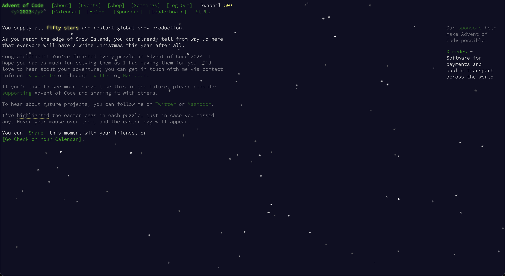

# Advent of Code Solutions

This repository contains my solutions for the Advent of Code challenges. Each day's solution is organized into its own folder with a Makefile for easy compilation and execution.

- [Usage](#usage)
- [Directory Structure](#directory-structure)
- [Notes](#notes)
- [Issues and Contributions](#issues-and-contributions)
- [Challenge Completion Screenshot](#challenge-completion-screenshot)


## Usage

1. Clone the repository:

    ```bash
    git clone https://github.com/Sinister-00/Advent-Of-Code-2023.git
    cd Advent-Of-Code-2023
    ```

2. Navigate to the specific day you want to solve:

    ```bash
    cd XX
    ```
    XX is the specific day you want to solve. say you want to solve `day 2` then you need to run this in terminal `cd 02`.

3. Replace the `input.txt` file with your own input.

4. Run the Makefile:

    ```bash
    make
    ```

   This will compile the solution and run the executable file which is generated by the name of the corresponding day.

5. If needed, clean up generated files:

    ```bash
    make clean
    ```

## Directory Structure

- A `output.txt` which has solutions of all days.
- Each day's solution is organized into its own folder (e.g., `day01`, `day02`, ...).
- Inside each day's folder:
  - `Makefile`: Contains compilation and execution rules.
  - `Solution.cpp` (or other source files): Source code for the solution.
  - `input.txt`: The input file for the specific day's challenge.

## Notes

- Make sure to have a C++ compiler installed on your system.
- Replace `input.txt` with your own input for each day.
- The repository is set up for easy execution with a simple `make` command.

Feel free to explore and adapt the solutions for your needs. Happy coding!


## Issues and Contributions

If you encounter any issues with the solutions or have suggestions for improvements, feel free to [open an issue](https://github.com/Sinister-00/Advent-Of-Code-2023/issues). I appreciate your feedback and will do my best to address the concerns promptly.

If you'd like to contribute to this repository:

1. Fork the repository to your GitHub account.
2. Create a new branch for your changes:

    ```bash
    git checkout -b feature/your-feature-name
    ```

3. Make your changes and commit them:

    ```bash
    git add .
    git commit -m "Add your meaningful commit message"
    ```

4. Push the changes to your fork:

    ```bash
    git push origin feature/your-feature-name
    ```

5. Open a pull request against the `main` branch of this repository.

I'll review and merge the pull requests as soon as possible. Thank you for your contributions!


## Challenge-completion-screenshot
  
